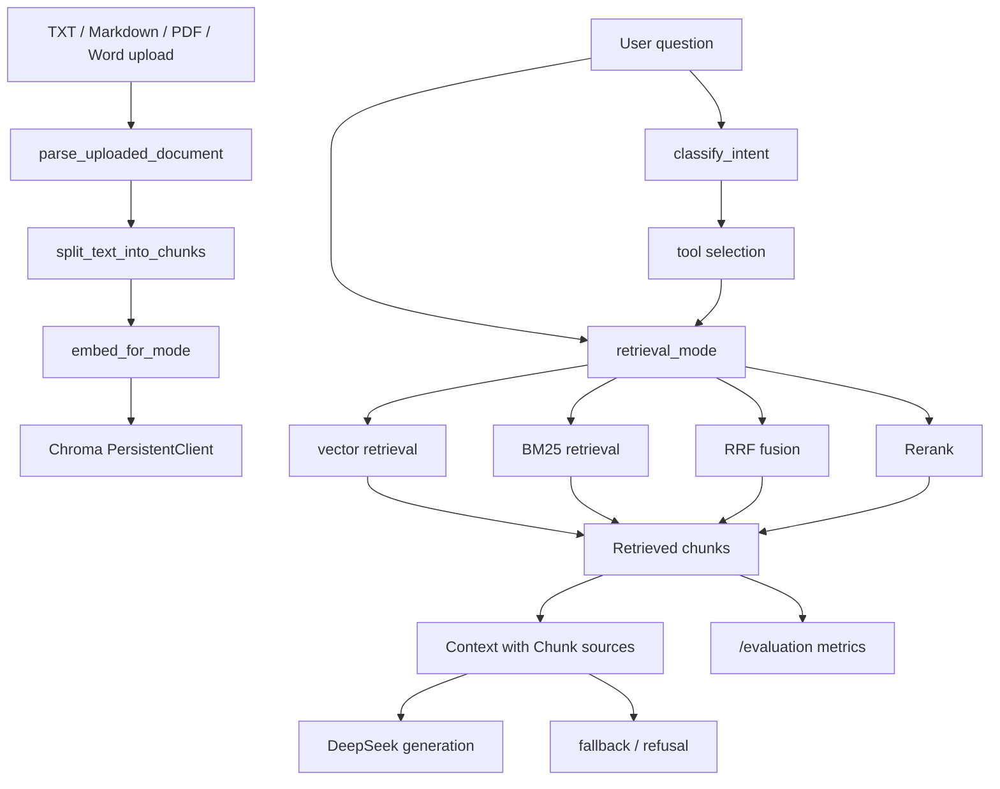

# DocuAsk Architecture

本文档记录 DocuAsk 当前已经实现并验证的架构，不包含未完成能力。

## 当前定位

DocuAsk 是一个本地文档 Agentic RAG 问答系统原型，当前结构为：

```text
Streamlit UI + FastAPI backend + file upload + reusable RAG services + Chroma persistent storage + agent planner + tool selection + rerank + LLM answer generation + retrieval evaluation
```

当前重点解决三个问题：

- 本地文档问答需要来源可追溯。
- 检索质量需要可量化评估。
- RAG 核心逻辑需要从页面中拆出，便于复用和测试。
- 问答流程需要具备 intent routing、tool selection、trace、轻量多轮上下文和拒答边界。

## 模块结构

```text
docuask/
  app.py
  API.md
  ARCHITECTURE.md
  backend/
    app.py
    README.md
    services/
      chunking.py
      embeddings.py
      retrieval.py
      agent.py
      generation.py
      bm25.py
      rrf.py
      rerank.py
      document_parser.py
      errors.py
      logging_config.py
      evaluation.py
    storage/
      chroma_db_v2/       # local ignored runtime data
  tests/
    test_backend_api.py
    test_retrieval_metrics.py
```

## 数据流



说明：

- `vector` 使用 Chroma cosine distance。
- `bm25` 使用本地轻量 BM25 关键词检索。
- `rrf` 融合 vector ranking 和 BM25 ranking。
- `rerank` 先召回候选 chunks，再做本地轻量重排。
- Agentic mode 会先判断 intent，再选择 retrieval/rerank/summary/refusal 工具。
- Streamlit 页面当前负责用户交互。
- FastAPI 后端当前负责文档入库、检索问答、Agentic ask、LLM answer 生成和检索评测。

## Service 边界

| Service | 职责 |
|---|---|
| `chunking.py` | 文档切分，优先按 Markdown `##` 标题切分，否则使用固定长度和 overlap |
| `embeddings.py` | 管理 Teaching keyword embedding 和 BGE Chinese embedding |
| `retrieval.py` | 管理 Chroma 持久化、collection 命名、向量检索和上下文格式化 |
| `agent.py` | 管理 intent routing、tool selection、Agent trace、fallback 和拒答 |
| `generation.py` | 管理 RAG prompt、DeepSeek 调用和 sources 格式化 |
| `bm25.py` | 提供关键词检索 baseline |
| `rrf.py` | 融合向量检索和 BM25 排名 |
| `rerank.py` | 对候选 chunk 做二阶段重排 |
| `document_parser.py` | 解析 TXT / Markdown / PDF / Word 上传文件 |
| `errors.py` | 统一错误码和错误响应结构 |
| `logging_config.py` | 基础日志配置 |
| `evaluation.py` | 固定 15 题检索评测，计算 Top-1 hit、Top-k recall 和 failure cases |

## 接口边界

| Endpoint | 当前职责 |
|---|---|
| `GET /health` | 后端健康检查 |
| `POST /documents` | 文档切分、embedding、写入 Chroma |
| `POST /documents/upload` | 接收 `.txt/.md/.pdf/.docx` 文件并复用文档入库流程 |
| `POST /qa` | 对已入库 collection 执行 Top-k 检索 |
| `POST /answer` | 检索 chunks 后调用 LLM 生成 answer 和 sources |
| `POST /agent/ask` | 执行 Agentic RAG：intent、tool selection、trace、fallback/refusal |
| `POST /agent/evaluation` | 评估 Agentic 行为：intent、工具选择、拒答和来源引用 |
| `POST /evaluation` | 用固定问题集评估检索模式，并记录 failure cases |

`POST /evaluation` 默认使用 FAQ 15 题，也支持传入自定义 `evaluation_cases`，用于不同文档配置不同问题集。

## Agentic RAG 流程

当前 Agentic RAG 是轻量规则型 planner，不依赖复杂多 Agent 框架：

```text
question -> classify_intent -> choose tools -> retrieve / scan / rerank -> answer or refuse -> trace
```

当前 intent：

| Intent | 说明 |
|---|---|
| `document_qa` | 普通文档问答 |
| `summary` | 总结文档或片段 |
| `compare` | 对比多个概念或片段 |
| `metadata_query` | 查询来源、chunk、引用信息 |
| `out_of_scope` | 文档外问题，触发拒答 |

`/agent/ask` 返回 `selected_tools`、`trace`、`confidence`、`fallback_reason` 和 `effective_question`，用于解释系统为什么检索、为什么拒答、为什么使用上下文答案，以及追问如何被重写。

## Agent Evaluation

`/agent/evaluation` 用固定 5 题检查 Agentic 行为：

| Metric | 说明 |
|---|---|
| `intent_accuracy` | intent 是否判断正确 |
| `tool_selection_accuracy` | 自动选择的检索/扫描工具是否符合预期 |
| `refusal_accuracy` | 文档外问题是否正确拒答 |
| `source_citation_rate` | 可回答问题是否返回来源 |

当前 FAQ 样例下四项指标均为 `1.0`。该结果只代表当前小样本评测，用于回归测试和展示系统行为，不代表生产环境泛化能力。

## 检索模式

| Mode | 适合场景 | 当前项目作用 |
|---|---|---|
| `vector` | 语义相似问题 | 原始向量检索 baseline |
| `bm25` | 关键词、专有名词、配置项问题 | 关键词检索 baseline |
| `rrf` | 需要融合语义和关键词排序 | 混合检索对比方案 |
| `rerank` | 候选已召回但 Top-1 排序不稳 | 二阶段重排方案 |

FAQ 固定评测结果：

```text
vector Top-1: 0.733, Top-k: 1.0
bm25   Top-1: 0.867, Top-k: 0.933
rrf    Top-1: 0.8,   Top-k: 0.933
rerank Top-1: 0.867, Top-k: 1.0
```

这个结果只能说明当前 FAQ 文档和 15 个固定问题下的表现。

## 持久化策略

Chroma 当前使用：

```text
backend/storage/chroma_db_v2/
```

collection 名称由三部分组成：

```text
embedding mode prefix + schema version + document hash
```

示例：

```text
uploaded_document_chunks_keyword_v3_xxxxxxxxxxxx
uploaded_document_chunks_bge_v3_xxxxxxxxxxxx
```

这样做的原因：

- 不同 embedding 维度不能混用同一个 collection。
- schema version 可以避开历史实验数据造成的索引冲突。
- document hash 用于让同一份文档生成稳定的 collection 名称；重新入库时会重建同名 collection，避免本地 Chroma/HNSW 旧索引状态影响验证。

## 自动化测试

当前测试目标不是测试 DeepSeek 生成，而是稳定验证本地检索链路：

```text
文档入库 -> collection 查询 -> 检索模式切换 -> Agentic ask -> Agent evaluation -> 固定问题评测 -> 错误分支
```

当前评测能力包括：

```text
默认 FAQ 评测 + Agent evaluation + 自定义 evaluation cases + 多文档小样本评测 + failure cases
```

原因：

- LLM API 依赖网络、额度和外部服务状态。
- 检索链路是 RAG 系统可控且必须稳定的核心。
- 自动化测试应该优先覆盖本地可重复验证的行为。

## 当前限制

当前仍不能夸大为：

- 生产级多用户系统。
- 支持扫描版 PDF OCR。
- 支持权限管理或多租户知识库。
- 大规模评测或压测完成。
- 已接入外部 rerank 模型。
- 大规模线上 LLM 调用稳定性验证。
- 当前 Agentic RAG 是轻量规则型 planner，不是多 Agent 框架。

更准确的当前表述：

```text
DocuAsk 已完成本地 `.txt/.md/.pdf/.docx` 文件上传、切分、向量入库、四种检索模式、Agentic RAG intent routing、tool selection、trace、轻量多轮上下文、拒答、Agent evaluation、来源上下文展示、LLM answer 生成、failure cases 和固定问题检索评测。
```

## 下一步

建议下一阶段优先做：

1. 扩大真实业务文档评测集。
2. 评估是否引入外部 cross-encoder rerank 模型。
